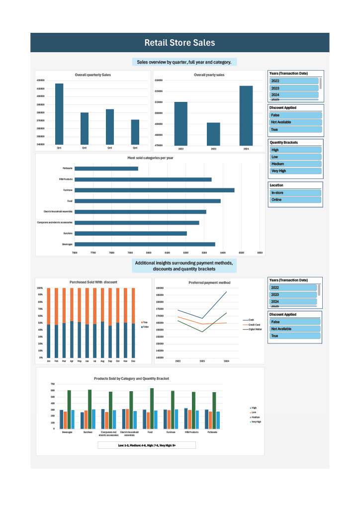

# Retail Store Sales

### Project Objectives

The primary objective of this project was to enhance my data cleaning and data visualization skills while performing a comprehensive analysis of retail sales data. The dataset was intentionally kept small to ensure a focused and manageable scope.

### Dataset Overview

[The original dataset can be found here.]('https://www.kaggle.com/datasets/ahmedmohamed2003/retail-store-sales-dirty-for-data-cleaning/data')

For this project, I selected a "dirty" dataset that mirrors real-world data challenges. It contains sales information from a retail store, and the focus was on cleaning and analysing this data to derive meaningful insights.

### Project Methodology

1. **Identifying Useful Information**  
   The dataset provided a wealth of information, including product prices, quantities sold, total spend, transaction dates, payment methods, discount details, and more. This allowed me to identify key areas for further analysis and move to the next step.

2. **Formulating Key Questions**  
   Upon reviewing the data, I identified several key questions to guide the analysis, with the understanding that I would also need to create additional calculated fields:
   - What are the total annual sales?
   - How do sales break down by quarter and month?
   - Which product has the highest sales volume (by quantity)?
   - What proportion of sales were made with a discount applied?
   - What are the most common payment methods?
   - Which product category generated the most sales?

3. **Data Cleaning and Preparation**  
   The initial phase involved standardizing the data, addressing issues such as duplicates, excess whitespace, inconsistent capitalization, incorrect data types (e.g., date fields), unnecessary decimal values, and null entries.

4. **Data Exploration**  
   Using pivot tables, I explored the sales data and conducted calculations such as categorizing purchases into quantity brackets (low, medium, high, and very high). This segmentation facilitated deeper insights into customer purchasing behavior. Additionally, I calculated total spending and average transaction values to further enrich the analysis.

5. **Data Visualization**  
   After extracting key insights, I designed a concise yet informative dashboard to present the results. Selecting appropriate visualizations for categorical data and sales trends over time was crucial. I also created dynamic slicers to enable interactive filtering of metrics, enhancing the user experience and making the visualizations more versatile.

